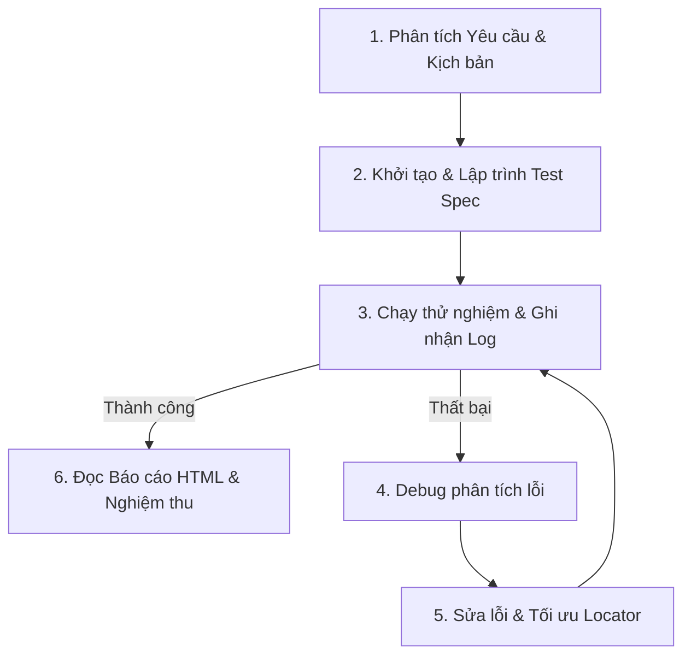

# Quy Trình Chuẩn Phát Triển & Gỡ Lỗi Playwright Test Case

Tài liệu này hướng dẫn chi tiết luồng làm việc tiêu chuẩn (Standard Workflow) dành cho Kỹ sư Kiểm thử Tự động để thực hiện trọn vẹn từ lúc nhận yêu cầu kịch bản cho tới khi chạy, gỡ lỗi và kiểm tra kết quả kiểm thử.

---

## 📋 Sơ Đồ Quy Trình Tổng Quan



---

## 📑 Các Bước Thực Hiện Chi Tiết

### 1. Phân Tích Yêu Cầu & Kịch Bản (Ingest Testcase Prompt)

- **Xác định tính độc lập (Test Hermeticity)**: Đánh giá xem kịch bản kiểm thử nên chạy trên dữ liệu động tự tạo mới (khuyên dùng để tránh flaky) hay dùng lại dữ liệu tĩnh đã có sẵn trên hệ thống (nếu đề bài yêu cầu).
- **Định vị Locator tiềm năng**: Xác định trước các phần tử UI chính. Ưu tiên các locators thân thiện với người dùng (User-facing locators) của Playwright như:
  - `page.getByPlaceholder('...')`
  - `page.getByRole('button', { name: '...' })`
  - `page.locator('tr').filter({ hasText: '...' })`

---

### 2. Khởi Tạo & Lập Trình Test Spec (Create Test File)

- Tạo file test mới tại đúng cấu trúc thư mục, ví dụ: `tests/product/edit-product-required.spec.ts`.
- Import các Page Objects cần thiết từ `src/pages/`.
- Cấu hình thời gian timeout tối đa phù hợp với hiệu năng môi trường (Ví dụ môi trường VNPost khuyến nghị dùng `test.setTimeout(90000)`).
- Viết mã nguồn kịch bản bám sát các bước trong kịch bản.

---

### 3. Thực Thi Kiểm Thử (Run Test File)

Chạy kịch bản kiểm thử từ Terminal bằng một trong các chế độ sau:

- **Chế độ chạy ngầm (Headless Mode - Nhanh nhất)**:
  ```bash
  npx playwright test tests/product/edit-product-required.spec.ts --project=chromium --reporter=list
  ```
- **Chế độ hiển thị trình duyệt trực tiếp (Headed Mode - Quan sát trực quan)**:
  ```bash
  npx playwright test tests/product/edit-product-required.spec.ts --project=chromium --headed
  ```
- **Chế độ giao diện tương tác (UI Mode - Khuyên dùng khi phát triển)**:
  ```bash
  npx playwright test tests/product/edit-product-required.spec.ts --project=chromium --ui
  ```

---

### 4. Phân Tích & Gỡ Lỗi (Debug Errors)

Khi kiểm thử thất bại, phân tích file log lỗi dựa trên các trường hợp phổ biến:

- **Lỗi Strict Mode Violation**: Xảy ra khi một locator tìm thấy từ 2 phần tử trở lên nhưng bạn thực hiện hành động cần duy nhất (ví dụ `.click()` hoặc `.toBeVisible()`).
  - _Cách khắc phục_: Thêm `.first()`, `.last()` hoặc `.nth(index)` vào sau bộ lọc locator.
- **Lỗi Sai Lầm Về Phạm Vi (Scoped Locator Error)**: Xảy ra khi bạn giới hạn tìm kiếm trong một container con (như `.ant-drawer-body`) nhưng phần tử cần click thực tế lại nằm ngoài container đó (như nút sửa ở header của drawer `.ant-drawer-header`).
  - _Cách khắc phục_: Thay đổi phạm vi tìm kiếm rộng hơn hoặc dùng trực tiếp từ `page`.
- **Lỗi Biến Mất Của Toast/Notification**: Các thông báo thành công/thất bại tự động tắt đi sau vài giây dẫn đến việc locator không tìm thấy nếu selector quá cụ thể hoặc có độ trễ lớn.
  - _Cách khắc phục_: Sử dụng bộ chọn bao quát lớp thông báo của AntD như `.ant-message-notice` hoặc `.ant-notification-notice`.

---

### 5. Sửa Lỗi & Tối Ưu (Fix & Refactor)

- Sửa đổi mã nguồn kiểm thử dựa trên phân tích ở Bước 4.
- **Quy tắc vàng**:
  - Hạn chế sử dụng `page.waitForTimeout()`. Hãy luôn ưu tiên dùng **Web-First Assertions** (`await expect(locator).toBeVisible()`) để Playwright tự động chờ đợi phần tử xuất hiện một cách thông minh.
  - Luôn đảm bảo mã nguồn sạch sẽ, xóa bỏ mọi file debug nháp khỏi workspace trước khi commit.

---

### 6. Chạy Lại & Nghiệm Thu Kết Quả (Verification & Report)

- Thực thi lại file test sau khi sửa lỗi để đảm bảo màn hình thông báo **passed** xanh lá:
  ```bash
  npx playwright test tests/product/edit-product-required.spec.ts --project=chromium --reporter=list
  ```
- Mở trang báo cáo chi tiết để kiểm tra lại các bước chạy và video/screenshot đính kèm:
  ```bash
  npx playwright show-report
  ```
  _(Nếu gặp lỗi trùng cổng `EADDRINUSE`, hãy chỉ định một cổng trống khác, ví dụ: `npx playwright show-report --port 9325`)_.
